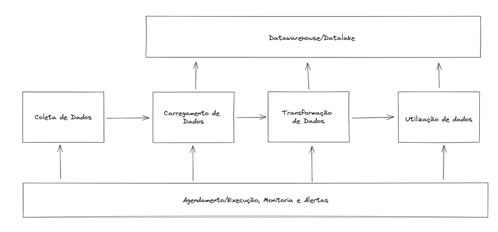
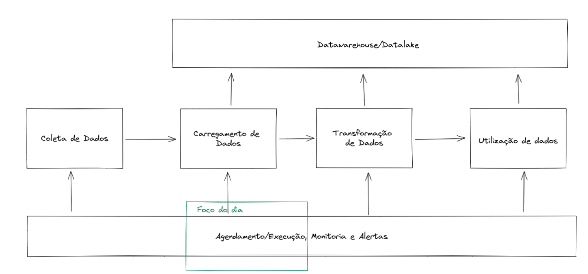

# Indicium Airflow Hands-on Tutorial

## O Problema

Vamos utilizar o mesmo problema do desafio de data engineering do processo seletivo da indicium:

https://github.com/techindicium/code-challenge

Básicamente precisamos extrair os dados do banco northwind(banco demo de ecommerce) para hd local primeiro, e depois do hd para um segundo banco de dados. Também precisamos fazer load de um arquivo com informação de vendas que por algum motivo vem de outro sistema em um arquivo csv. 

Com esses dados juntos em um database, gostariamos de saber quanto foi vendido em um dia

O pipeline vai ficar algo parecido com o seguinte:


e os dados no hd devem ficar parecido com o segundo esquema:

```
/data/postgres/{table}/2021-01-01/file.format
/data/postgres/{table}/2021-01-02/file.format
/data/csv/2021-01-02/file.format
```

## Bem pouco sobre Data Engineering

Existem várias formas de definir o que faz um Engenheiro de Dados, mas dificimente o trabalho de um DE não vai incluir as seguintes funções:



Todas essas etapas(coleta, transformação, agendamento.. ) são areas que sózinhas podem ser assuntos de discussões infinitas. Na conversa de hoje 
vamos focar na parte de agendamento e execução para começar a resolver o problema citado acima.




## Possiveis Soluções

A primeira ideia que pode vir a cabeça é usar o crontab do linux. Crontab é bastante util para executar scripts agendados em horários específicos, mas e se 

- precisarmos definir um número grande de dependencias?
- re-executar o pipeline inteiro?
- ter uma noção de quais etapas do pipeline estão demorando mais?
- Enviar emails em caso de falha?

Todos esses pontos são ou essencias ou muito importantes em projetos em produção.

Tudo isso poderia ser feito desenvolvendo código próprio junto ao cron, mas já existem algumas plataforma com esse exato objetivo como Airflow, Prefect e Dagster.

Airflow é a ferramenta mais utilizada e no momento que escrevo esse tutorial com o maior número de features e integrações com outros sistemas.

Nesse tutorial seguiremos com Airflow.


## O Airflow

do site do próprio airflow:

    Airflow is a platform created by the community to programmatically author, schedule and monitor workflows.


## Primeiras Impressões

Para ter uma ideia do que se trata a ferramenta, primeiro vamos executar o Airflow localmente com os DAGS(Directed acyclic graphs, o conceito usado para implementar pipelines).

para instalar o airflow vamos primeiro criar um virtualenv e depois rodar o script install.sh. Esse script é um ctrl c ctrl v das instruções encontradas no site.

```
virtualenv venv -p python3
source venv/bin/activate
bash install.sh
```

Se as coisas deram certo, no terminal vai aparecer a seguinte mensagem:

```
standalone | 
standalone | Airflow is ready
standalone | Login with username: admin  password: ******
standalone | Airflow Standalone is for development purposes only. Do not use this in production!
standalone |

```
A senha de fato é gerada automaticamente pelo Airflow e vai aparecer nos logs, no lugar de "****".

airflow roda na porta 8080, então podemos acessar em 
http://localhost:8080

Tome um tempo aqui para ver a interface, as dags, tome um tempo para explorar a interface.

## Limpando os Dags de Exemplo

Para tirar os dags de exemplo e começar um dag nosso, podemos apagar os arquivos
airflow-data/data e airflow-data/admin-password.txt, e editar o arquivo airflow.cfg trocando:
```
load_examples = True
```
para
```
load_examples = False
```

Feito isso, primeiro precisamos configurar o ambiente para dizer onde vão ficar os arquivos de config do airflow, fazemos isso configurando a seguinte variavel de ambiente:

```
export AIRFLOW_HOME=./airflow-data
```

Dessa forma configuramos o airflow para colocar suas configurações dentro da pasta desse tutorial na pasta /airflow-data

Na sequência rodamos o comando para resetar o db do airflow e fazer start do airflow local:

```
airflow db reset
airflow standalone
```

## Escrevendo primeiro DAG

O Airflow procura por DAGs na em arquivos .py no diretório:

```
AIRFLOW_HOME/dags
```

Em nosso caso AIRFLOW_HOME é airflow-data, entao criaremos uma pasta dags e um arquivo
elt_dag.py dentro de airflow-data com o seguinte conteudo:

```py
from airflow.utils.edgemodifier import Label
from datetime import datetime, timedelta
from textwrap import dedent
from airflow.operators.bash import BashOperator
from airflow import DAG

# These args will get passed on to each operator
# You can override them on a per-task basis during operator initialization
default_args = {
    'owner': 'airflow',
    'depends_on_past': False,
    'email': ['airflow@example.com'],
    'email_on_failure': True,
    'email_on_retry': True,
    'retries': 1,
    'retry_delay': timedelta(minutes=5),
}

with DAG(
    'NorthwindELT',
    default_args=default_args,
    description='A ELT dag for the Northwind ECommerceData',
    schedule_interval=timedelta(days=1),
    start_date=datetime(2021, 1, 1),
    catchup=False,
    tags=['example'],
) as dag:
    dag.doc_md = """
        ELT Diária do banco de dados de ecommerce Northwind,
        começando em 2022-02-07. 
    """

    extract_postgres_task = BashOperator(
        task_id='extract_postgres',
        bash_command='echo "Extracted!" ',
    )
    
    extract_postgres_task.doc_md = dedent(
        """\
    #### Task Documentation

    Essa task extrai os dados do banco de dados postgres, parte de baixo do step 1 da imagem:
 
    

    """
    )

```

Dê um refresh no airflow e veja se o dag apareceu.

Aqui podemos parar para entender alguns conceitos do airflow.


## Conceito DAG do Airflow

Pegando o trecho da parte de DAG do nosso primeiro dag:

```py
from airflow import DAG

# These args will get passed on to each operator
# You can override them on a per-task basis during operator initialization
default_args = {
    'owner': 'airflow',
    'depends_on_past': False,
    'email': ['engineering@indicium.tech'],
    'email_on_failure': True,
    'email_on_retry': True,
    'retries': 1,
    'retry_delay': timedelta(minutes=5),
}

with DAG(
    'NorthwindELT',
    default_args=default_args,
    description='A ELT dag for the Northwind ECommerceData',
    schedule_interval=timedelta(days=1),
    start_date=datetime(2022, 2, 1),
    catchup=False,
    tags=['ELT'],
) as dag:
```

O que estamos fazendo aqui é declarando e configurando um DAG e as propriedades comuns a todas as tasks na propriedade default_args.

Todas as tasks do nosso dag vão ter:
  - o dono 'airflow'
  - nao vão depender de execuções passadas
  - vão mandar email em retry e falha para engineering@indicium.tech
  -   ...

E nosso DAG vai chamar NorthwindELT e rodar diariamente na hora 0.


## Conceito Operator do  Airflow

Da documentação:

*An operator represents a single, ideally idempotent, task. Operators determine what actually executes when your DAG runs.*

Ou seja, quem de fato executa alguma tarefa são os operators e não o código do DAG. O código que vimos na logo acima apenas declara um dag, nada de fato vai ser executado naquele código.

Essa distinção é importante porque o Airflow interpreta o código do dag com frequencia bem alta, algumas vezes por minuto(isso é configurável).

Se alguma operação grande for executada no código do dag em si, essa operação vai ser executada o tempo todo, e não apenas no agendamento declarado no contexto do DAG.

No nosso caso, o operator é:

```py
    extract_postgres_task = BashOperator(
        task_id='extract_postgres',
        bash_command='echo "Extracted!" ',
    )
```

O código que vai ser de fato excecutado nesse caso é o bash_command, nesse exemplo:

```
echo "Extracted!"
```

se olharmos o log da task executada, podemos ver:

```
[2022-02-09, 18:10:31 UTC] {subprocess.py:74} INFO - Running command: ['bash', '-c', 'echo "Extracted!" ']
[2022-02-09, 18:10:31 UTC] {subprocess.py:85} INFO - Output:
[2022-02-09, 18:10:31 UTC] {subprocess.py:89} INFO - Extracted!
```

## Declarando Dependencias

Agora temos um DAG com uma task, nao parece um caso de uso altamente justificavel para um deploy de Airflow. Mas conforme a descrição do problema, precisamos também fazer load dos dados extraidos para um banco de dados, e precisamos fazer load do arquivo csv para o banco tambem.

Vamos montar esse fluxo, primeiro criamos mais 2 tasks:

```py

    load_postgres_data_to_db_task = BashOperator(
        task_id='load_postgres',
        bash_command='echo "Loaded postgres data to db!" ',
    )

    load_postgres_data_to_db_task.doc_md = dedent(
        """\
    #### Task Documentation

    Essa task faz load dos dados extraidos do postgres para hd, load para o banco de dados
    da parte dos dados extraidos do postgres no step 2 da imagem:
 
    

    """
    )

    load_csv_data_to_db_task = BashOperator(
        task_id='load_csv',
        bash_command='echo "Loaded csv data to db!" ',
    )

    load_csv_data_to_db_task.doc_md = dedent(
        """\
    #### Task Documentation

    Essa task faz load dos dados csv, load para o banco de dados
    da parte dos dados extraidos do csv no step 2 da imagem: 
    
    

    """
    )
```

E na sequencia definimos a dependência:

```py
    extract_postgres_task >> load_postgres_data_to_db_task
    extract_postgres_task >> load_csv_data_to_db_task    
```

Agora podemos ver que as duas tasks novas dependem da primeira task que criamos.

Aqui podemos ver que essa dependencia não faz muito sentido, não precisamos da extração do postgres para fazer o load dos dados csv para o banco. 

Podemos simplesmente tirar a dependencia entre elas


```py
    extract_postgres_task >> load_postgres_data_to_db_task
    extract_postgres_task >> load_csv_data_to_db_task    
```

Para finalizar a o problema enunciado no inicio, precisariamos fazer uma task para fazer uma query no banco após os 2 loads terem sido feitos:

```py
    run_sales_query_task = BashOperator(
        task_id='run_sales_query_task',
        bash_command='echo "we sold alot!!" ',
    )

    run_sales_query_task.doc_md = dedent(
        """\
    #### Task Documentation
        Query em cima do banco consolidado, pegando o valor das vendas para o dia
    """

    
```

e colocamos as novas dependencias:

```py
    extract_postgres_task >> load_postgres_data_to_db_task >> Label("Resultado Consolidado") >> run_sales_query_task
    load_csv_data_to_db_task >> Label("Resultado Consolidado") >> run_sales_query_task
```


## Revendo Objetivos

Citamos no inicio que um projeto de produção deveria ter os seguintes aspectos:

- precisarmos definir um número grande de dependencias?
- re-executar o pipeline inteiro?
- ter uma noção de quais etapas do pipeline estão demorando mais?
- Enviar emails em caso de falha?

O primeiro ponto deve ter ficado evidente com os passos anteriores.

### **Re-executar o pipeline inteiro?**

Isso podemos fazer pela interface, clicar no quadrado de cima, e apertar clear.
Tambem podemos usar o cli do terminal do airflow, docs: https://airflow.apache.org/docs/apache-airflow/stable/cli-and-env-variables-ref.html

Para nosso caso seria algo:

```
airflow clear NorthwindELT -s 2022-02-07 -e 2022-02-08
```

Vamos deixar para voces fazerem o teste e fica o desafio de corrigir o comando. É bom lembrar que quase todas as operações possiveis pela interface também é possível via CLI.


### **Ter uma noção de quais etapas do pipeline estão demorando mais?**

Vamos colocar um sleep na task do postgres para que uma demore mais que o resto:


```py
    extract_postgres_task = BashOperator(
        task_id='extract_postgres',
        -- bash_command='echo "Extracted!" ',
        ++ bash_command='sleep 10 && echo "Extracted!" ',
    )
```

Agora façamos o clear denovo e depois olhamos a aba gantt

Aqui vai ficar claro que as tasks mesmo sem inter dependencias, não executaram em paralelo. Isso acontece porque o airflow tem o conceito de Executors, isso é uma configuração do airflow para definir o modo que ele vai executar as tasks, não vamos entrar em muitos detalhes aqui mas o airflow possue alguns executores, como KubernetesExecutor, SequentialExecutor e LocalExecutor. Na configuração padrão, o modo é o SequentialExecutor que roda apenas uma task por vez.

### **Enviar emails em caso de falha?**

vamos fazer uma task falhar:

```py
    extract_postgres_task = BashOperator(
        task_id='extract_postgres',
        -- bash_command='echo "Extracted!" ',
        ++ bash_command='isaa!!!',
    )
```

se olharmos os logs, vamos ver que o airflow tentou enviar um email, mas como não configuramos o servidor SMTP o envio também falhou.


## Outros Conceitos Importantes

### Airflow Variables

O Airflow possue o conceito de variaveis que permite configurar via cli ou UI valores utilizados no dag.
Uma vez criado a variavél, ela pode ser utilizada no formato:

```py
from airflow.models import Variable
email_list = Variable.get("email_list")

default_args = {
    'owner': 'airflow',
    'depends_on_past': False,
    'email': email_list,
    'email_on_failure': True,
    'email_on_retry': True,
    'retries': 1,
    'retry_delay': timedelta(minutes=5),
}
```

nesse exemplo conseguimos mudar quem recebe emails de falha sem dificuldade.

Uma desvantagem bastante importante de notar aqui, é que essas variaveis nao ficam versionadas em nenhum lugar
se alguem alterar uma variavel pelo airflow existe boa chance de ninguem saber que isso aconteceu.

### Airflow Connections

para evitar configurar em diversos pontos conexões com sistemas externos, e evitar espalhar informações como usuários e senhas desses sistemas, o airflow possue o conceito de connections.

Assim como variables essas Connections podem ser criadas por cli ou pela UI

por exemplo para usar o Operator postgres para executar queries:

```py
get_all_pets = PostgresOperator(
    task_id="get_northwind_sales",
    postgres_conn_id="nortwhwind_postgres",
    sql="SELECT * FROM pet;",
)
```
[Todo] colocar isso no nosso dag com exemplo reallendo do banco northwind

# eltpipeline
